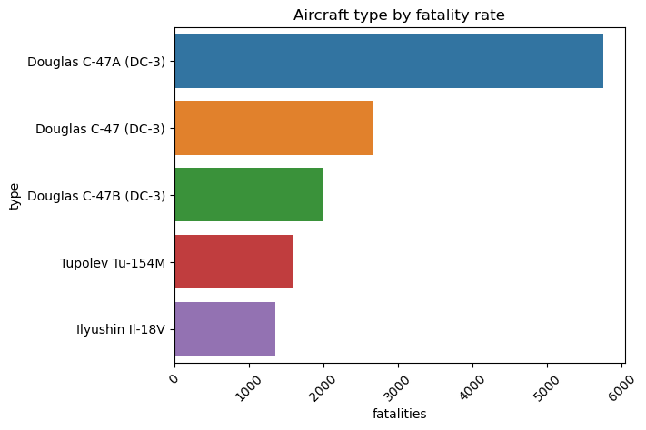

## Aviation Accident Analysis
This notebook explores aviation accident and fataity data from 1919 to 2023. The goal of the project is to measure and rank safety risks for the company's new airline division's first aircraft purchase and ts operational strategy.

## Business Problem
Our company is launching a new division that is focused on buying and operating airplanes for commercial and private enterprises. Since we lack experience in this area, my goal is to reduce risks associated with this venture. I am examining aviation accident data from 1919 to 2023 to find the safest and lowest-risk aircraft models for our first fleet purchase. I will turn my findings into actionable insights for the head of the new aviation division to use.

## Objectives
- Which aircraft type poses the most the most risk and should be excluded from purchase?

- Which operators pose the most risk and should not be considered during vetting?

- Which countries show the highest risk of having aircraft accidents and need more safety measures?

## Project Structure
- `index.ipynb` - This is the notebook that contains all data cleaning methods, analysis code and the visualizations.
- `csv`- contains all csv files both raw and clean.
- `viualizations` - contains the visualization of the three objectives
- `images` - contains all images that are used in the notebook

## Libraries and Tech used
- **Python 3.11**
- `Pandas`('https://pandas.pydata.org/')
- `matplotlib` ('https://matplotlib.org/')
- `seaborn` ('https://seaborn.pydata.org/')

## Visualizations and Findings
- **Aircraft-type-risk**
This visualizations tells us which aircraft type has the highest fatality rate. By identifying this, this report gives the company the necessary data for the company to make the safest decision that will benefit both the comapny and he clients
- 

**Operator-Risk**
This analysis shows the top 5 operators involved in the highest fatalities. This is crucial for our company when looking for operators as we will look for clients whose safety records are not of risk, ensuring they are not a liability.

**High-risk-countries**
This analysis shows the country that are at high risk of having accidents. This is important cause it tells the company which countries are safer and which countries need a greater safety approach when travelling there.

## Recommendation
- **Safe-Aircraft-Purchase:**
The Douglas C-47A(DC-3) should not be considered when purchasing aircrafts, since it carries the highest fatality count and therefore will be a risk to the company and our clients. The company should look into the aircrafts with the lowest fatality count as they are the safer bet for the new airline division.

- **Low-risk-Operators:**
The company should prioritize operators that have the lowest fatality rates cause they are less risky than the operators who have high fatality counts.

- **Safety-measures-for-high-risk-countries:**
We should look for more safety measures when operating in countries that are at high risk of having airplane accidents instead of exluding them. This is cause they may have more flights therefore may be prone to more airline accidents

- ## Conclusion
This analysis shows us that the aviation industry is a risky endeavour. We have decided to exlude the Douglas C-47A (DC-3) as it has the biggest risk to our company. The high-risk countries show areas that need closer examination like the USA, which may have alot of operational activity, hence the rise in accident rates. Finally the operator analysis gives us a safety benchmark that gives direction to our company in which operators are suited.